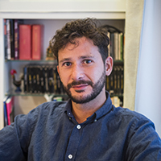
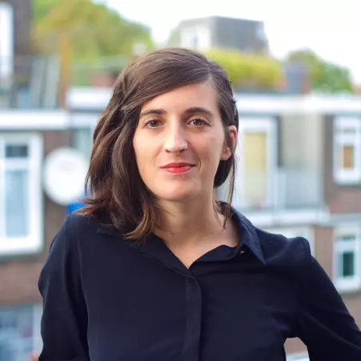
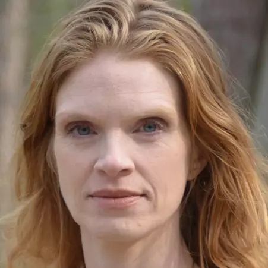

## The Supervisory Team

We are 8 supervisors from across the Department of Urbanism, bringing together expertise in design, data, planning, and climate adaptation.

:::::::::::::::::::: {.row .row-cols-1 .row-cols-md-2 .g-4 .supervisor-grid}

<!-- 1 -->
:::: {.col}
::: {.card .h-100 .p-3 .text-center}

### Daniele Cannatella

Assistant Professor

<strong>Section:</strong> Urban Data Science

<strong>Email:</strong> <a href="mailto:d.cannatella@tudelft.nl">d.cannatella@tudelft.nl</a>

<ul>
<li><strong>Expertise:</strong> Data-driven urban planning, climate adaptation, spatial analysis, cartography, green-blue infrastructure, GIS, R programming</li>
<li><strong>Mentorship:</strong> 1st mentor: 3 students; 2nd mentor: 2 students</li>
</ul>
:::
::::

<!-- 2 -->
:::: {.col}
::: {.card .h-100 .p-3 .text-center}

### Claudiu Forgaci

Assistant Professor

<strong>Section:</strong> Urban Design

<strong>Email:</strong> <a href="mailto:c.forgaci@tudelft.nl">c.forgaci@tudelft.nl</a>

<ul class="list-unstyled text-start small mx-auto" style="max-width: 300px;">
<li><strong>Expertise:</strong> Data-informed design, urban data science, spatial analysis, urban resilience, green-blue infrastructure, R programming</li>
<li><strong>Mentorship:</strong> 1st mentor: 3 students; 2nd mentor: 2 students</li>
</ul>
:::
::::

<!-- 3 -->
:::: {.col}
::: {.card .h-100 .p-3 .text-center}

### Clémentine Cottineau-Mugadza

Assistant Professor

<strong>Section:</strong> Urban Studies

<strong>Email:</strong> <a href="mailto:c.cottineau@tudelft.nl">c.cottineau@tudelft.nl</a>

<ul class="list-unstyled text-start small mx-auto" style="max-width: 300px;">
<li><strong>Expertise:</strong> Quantitative geography, socioeconomic inequalities, spatial segregation, residential choice and mobility, interactive data visualization</li>
<li><strong>Mentorship:</strong> 1st mentor: 1 student; 2nd mentor: 1 student</li>
</ul>
:::
::::

<!-- 4 -->
:::: {.col}
::: {.card .h-100 .p-3 .text-center}

### Juliana Gonçalves

Assistant Professor

<strong>Section:</strong> Urban Design

<strong>Email:</strong> <a href="mailto:j.goncalves@tudelft.nl">j.goncalves@tudelft.nl</a>

<ul class="list-unstyled text-start small mx-auto" style="max-width: 300px;">
<li><strong>Expertise:</strong> Citizen participation, digital participation, climate adaptation</li>
<li><strong>Mentorship:</strong> 2nd mentor: 1 student</li>
</ul>
:::
::::

<!-- 5 -->
:::: {.col}
::: {.card .h-100 .p-3 .text-center}

### Birgit Hausleitner

Assistant Professor

<strong>Section:</strong> Urban Design

<strong>Email:</strong> <a href="mailto:b.hausleitner@tudelft.nl">b.hausleitner@tudelft.nl</a>

<ul class="list-unstyled text-start small mx-auto" style="max-width: 300px;">
<li><strong>Expertise:</strong> Space syntax, pattern language, typology construction, metropolitan transformation, urban economy</li>
<li><strong>Mentorship:</strong> 1st mentor: 1 student; 2nd mentor: 2 students</li>
</ul>
:::
::::

<!-- 6 -->
:::: {.col}
::: {.card .h-100 .p-3 .text-center}

### Daniela Maiullari

Assistant Professor

<strong>Section:</strong> Environmental Technology & Design

<strong>Email:</strong> <a href="mailto:d.maiullari@tudelft.nl">d.maiullari@tudelft.nl</a>

<ul class="list-unstyled text-start small mx-auto" style="max-width: 300px;">
<li><strong>Expertise:</strong> Environmental modeling, microclimate analysis</li>
<li><strong>Mentorship:</strong> 2nd mentor: 1 student</li>
</ul>
:::
::::

<!-- 7 -->
:::: {.col}
::: {.card .h-100 .p-3 .text-center}

### Ignacio Urria Yáñez

PhD Researcher

<strong>Section:</strong> Urban Data Science

<strong>Email:</strong> <a href="mailto:I.A.UrriaYanez@tudelft.nl">I.A.UrriaYanez@tudelft.nl</a>

<ul class="list-unstyled text-start small mx-auto" style="max-width: 300px;">
<li><strong>Expertise:</strong> Socio-Spatial Inequality, Multi-Scale Urban Analysis, Geographic Data Science, Urban Change, Neighbourhood Effects</li>
</ul>
:::
::::

<!-- 8 -->
:::: {.col}
::: {.card .h-100 .p-3 .text-center}

### Marjolein van Esch

Assistant Professor

<strong>Section:</strong> Environmental Technology & Design

<strong>Email:</strong> <a href="mailto:m.vanesch@tudelft.nl">m.vanesch@tudelft.nl</a>

<ul class="list-unstyled text-start small mx-auto" style="max-width: 300px;">
<li><strong>Expertise:</strong> Environmental modeling, microclimate analysis, climate adaptation</li>
<li><strong>Mentorship:</strong> 2nd mentor: 1 student</li>
</ul>
:::
::::

::::::::::::::::::::
