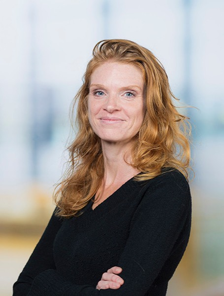
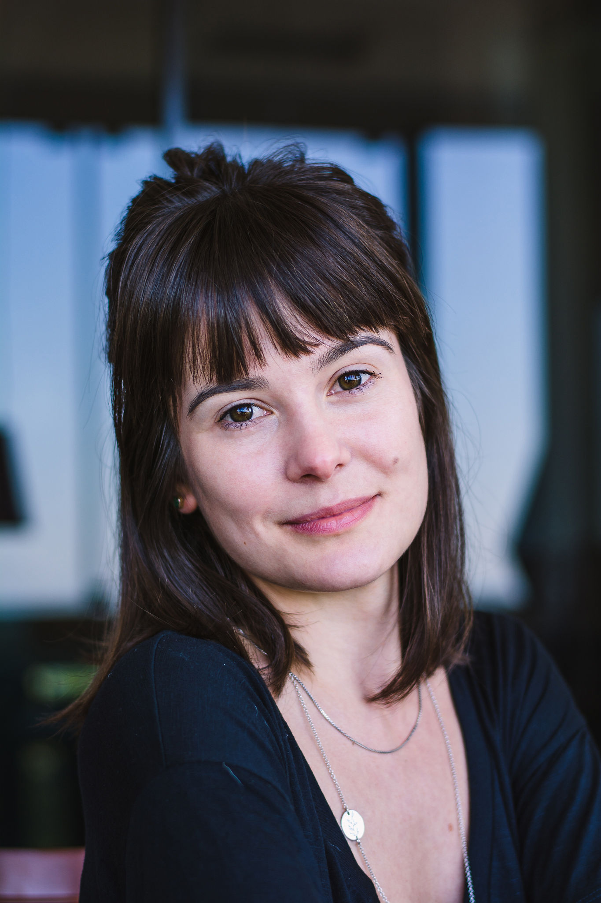

## The Supervisory Team

We are 7 supervisors from across the Department of Urbanism, bringing together expertise in design, data, planning, and climate adaptation.

::::::::::::::::: {.row .row-cols-1 .row-cols-md-2 .g-4 .supervisor-grid}
<!-- 1 -->

:::: col
::: {.card .h-100 .p-3 .text-center}


### Daniele Cannatella

<p class="text-muted mb-1">

Assistant Professor

</p>

<p><strong>Section:</strong> Urban Data Science</p>

<p><strong>Email:</strong> <a href="mailto:d.cannatella@tudelft.nl">d.cannatella\@tudelft.nl</a></p>

<ul class="list-unstyled text-start small mx-auto" style="max-width: 300px;">

<li><strong>Expertise:</strong> GIS, Data-informed design, MCDA</li>

<li><strong>Mentorship:</strong> First mentor: 3 students & Second mentor: 1 student</li>

</ul>
:::
::::

<!-- 2 -->

:::: col
::: {.card .h-100 .p-3 .text-center}


### Claudiu Forgaci

<p class="text-muted mb-1">

Assistant Professor

</p>

<p><strong>Section:</strong> Urban Design</p>

<p><strong>Email:</strong> <a href="mailto:C.Forgaci@tudelft.nl">C.Forgaci\@tudelft.nl</a></p>

<ul class="list-unstyled text-start small mx-auto" style="max-width: 300px;">

<li><strong>Expertise:</strong> Climate adaptation, Resilience, Urban metabolism</li>

<li><strong>Mentorship:</strong> First mentor: 3 students & Second mentor: 1 student</li>

</ul>
:::
::::

<!-- 3 -->

:::: col
::: {.card .h-100 .p-3 .text-center}


### Daniela Maiullari

<p class="text-muted mb-1">

Assistant Professor

</p>

<p><strong>Section:</strong> Environmental Technology & Design</p>

<p><strong>Email:</strong> <a href="mailto:D.Maiullari@tudelft.nl">D.Maiullari\@tudelft.nl</a></p>

<ul class="list-unstyled text-start small mx-auto" style="max-width: 300px;">

<li><strong>Expertise:</strong> Spatial modelling, Data visualization</li>

<li><strong>Mentorship:</strong> Second mentor: 1 student</li>

</ul>
:::
::::

<!-- 4 -->

:::: col
::: {.card .h-100 .p-3 .text-center}


### Clémentine Cottineau-Mugadza

<p class="text-muted mb-1">

Assistant Professor

</p>

<p><strong>Section:</strong> Urban Studies</p>

<p><strong>Email:</strong> <a href="mailto:C.Cottineau@tudelft.nl">C.Cottineau\@tudelft.nl</a></p>

<ul class="list-unstyled text-start small mx-auto" style="max-width: 300px;">

<li><strong>Expertise:</strong> Landscape-based design, Peri-urban regions</li>

<li><strong>Mentorship:</strong> First mentor: 1 student & Second mentor: 1 student</li>

</ul>
:::
::::

<!-- 5 -->

:::: col
::: {.card .h-100 .p-3 .text-center}


### Marjolein van Esch

<p class="text-muted mb-1">

Assistant Professor

</p>

<p><strong>Section:</strong> Environmental Technology & Design</p>

<p><strong>Email:</strong> <a href="mailto:m.m.e.vanesch@tudelft.nl">m.m.e.vanesch\@tudelft.nl</a></p>

<ul class="list-unstyled text-start small mx-auto" style="max-width: 300px;">

<li><strong>Expertise:</strong> Urban climate, urban heat, heat stress, climate adaptation</li>

<li><strong>Mentorship:</strong> Second mentor: 1 student</li>

</ul>
:::
::::

<!-- 6 -->

:::: col
::: {.card .h-100 .p-3 .text-center}


### Juliana Goncalves

<p class="text-muted mb-1">

Assistant Professor

</p>

<p><strong>Section:</strong> Spatial Planning & Strategy</p>

<p><strong>Email:</strong> <a href="mailto:J.E.Goncalves@tudelft.nl">J.E.Goncalves\@tudelft.nl</a></p>

<ul class="list-unstyled text-start small mx-auto" style="max-width: 300px;">

<li><strong>Expertise:</strong> Climate action, transformative adaptation, participation, collective action, spatial justice</li>

<li><strong>Mentorship:</strong> Second mentor: 1 student</li>

</ul>
:::
::::

<!-- 7 -->

:::: col
::: {.card .h-100 .p-3 .text-center}


### Ana Petrović

<p class="text-muted mb-1">

Assistant Professor

</p>

<p><strong>Section:</strong> Urban Studies</p>

<p><strong>Email:</strong> <a href="mailto:A.Petrovic@tudelft.nl">A.Petrovic\@tudelft.nl</a></p>

<ul class="list-unstyled text-start small mx-auto" style="max-width: 300px;">

<li><strong>Expertise:</strong></li>

<li><strong>Mentorship:</strong> Second mentor: 1 student</li>

</ul>
:::
::::

```{=html}
<!--
:::: col
::: {.card .h-100 .p-3 .text-center}


### Birgit Hausleitner

<p class="text-muted mb-1">
Lecturer
</p>

<p><strong>Section:</strong> Urban Design</p>

<p><strong>Email:</strong> <a href="mailto:B.Hausleitner@tudelft.nl">B.Hausleitner\@tudelft.nl</a></p>

<ul class="list-unstyled text-start small mx-auto" style="max-width: 300px;">
<li><strong>Expertise:</strong></li>
<li><strong>Mentorship:</strong> Second mentor only</li>
</ul>
:::
::::
-->
```

```{=html}
<!--
:::: col
::: {.card .h-100 .p-3 .text-center}


### Achilleas Psyllidis

<p class="text-muted mb-1">
Associate Professor
</p>

<p><strong>Section:</strong> Sustainable Design Engineering (IO)</p>

<p><strong>Email:</strong> <a href="mailto:A.Psyllidis@tudelft.nl">A.Psyllidis\@tudelft.nl</a></p>

<ul class="list-unstyled text-start small mx-auto" style="max-width: 300px;">
<li><strong>Expertise:</strong> Urban mobility</li>
<li><strong>Mentorship:</strong> Second mentor only</li>
</ul>
:::
::::  -->
```
:::::::::::::::::

::::
